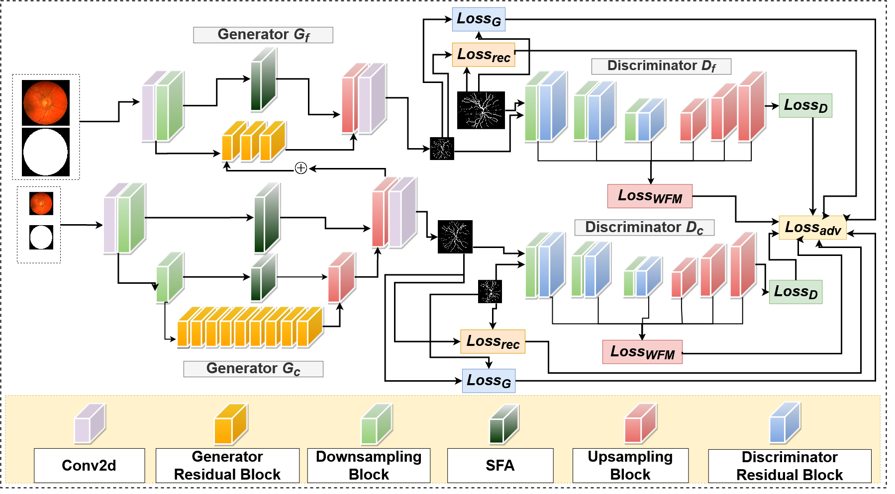

# 3D RVGAN

This code is modified version of the official "[RV-GAN](https://github.com/SharifAmit/RVGAN): Segmenting Retinal Vascular Structure inFundus Photographs using a Novel Multi-scaleGenerative Adversarial Network" which is part of the supplementary materials for MICCAI 2021 conference. This version dedicated for Brain Tumor Segmentation from 3D images.



### RVGAN Arxiv Pre-print
```
https://arxiv.org/pdf/2101.00535v2.pdf
```


## Pre-requisite
- Ubuntu 18.04 / Windows 7 or later
- NVIDIA Graphics card

## Installation Instruction for Ubuntu
- Download and Install [Nvidia Drivers](https://www.nvidia.com/Download/driverResults.aspx/142567/en-us)
- Download and Install via Runfile [Nvidia Cuda Toolkit 10.0](https://developer.nvidia.com/cuda-10.0-download-archive?target_os=Linux&target_arch=x86_64&target_distro=Ubuntu&target_version=1804&target_type=runfilelocal)
- Download and Install [Nvidia CuDNN 7.6.5 or later](https://developer.nvidia.com/rdp/cudnn-archive)
- Install Pip3 and Python3 enviornment
```
sudo apt-get install pip3 python3-dev
```
- Install Tensorflow-Gpu version-2.0.0 and Keras version-2.3.1
```
sudo pip3 install tensorflow-gpu==2.0.0
sudo pip3 install keras==2.3.1
```
- Install packages from requirements.txt
```
sudo pip3 install -r requirements.txt
```


### Dataset download link for DRIVE
```
https://figshare.com/articles/dataset/brain_tumor_dataset/1512427
```


### NPZ file conversion
- Convert all the images to npz format using **convert_npz_DRIVE.py**, **convert_npz_STARE.py** or **convert_npz_CHASE.py** file. 
```
python3 convert_npz_DRIVE.py --input_dim=(64,64,64) --outfile_name='DRIVE'
```
- There are different flags to choose from. Not all of them are mandatory.
```
    '--input_dim', type=int, default=(64,64,64)
    '--outfile_name', type=str, default='DRIVE'
```

## Training

- Type this in terminal to run the train.py file
```
python3 train.py --npz_file=DRIVE --batch=4 --epochs=200 --savedir=RVGAN --resume_training=no --inner_weight=0.5
```
- There are different flags to choose from. Not all of them are mandatory

```
   '--npz_file', type=str, default='DRIVE.npz', help='path/to/npz/file'
   '--batch_size', type=int, default=24
   '--input_dim', type=int, default=64
   '--epochs', type=int, default=200
   '--savedir', type=str, required=False, help='path/to/save_directory',default='RVGAN'
   '--resume_training', type=str, required=False,  default='no', choices=['yes','no']
   '--inner_weight', type=float, default=0.5
```


## Inference

- Type this in terminal to run the infer.py file
```
python3 infer.py --test_data=DRIVE --out_dir=test --weight_name_global=global_model_100.h5 --weight_name_local=local_model_100.h5 --stride=3 
```
- There are different flags to choose from. Not all of them are mandatory

```
    '--test_data', type=str, default='DRIVE', required=True, choices=['DRIVE','CHASE','STARE']
    '--out_dir', type=str, default='pred', required=False)
    '--weight_name_global',type=str, help='path/to/global/weight/.h5 file', required=True
    '--weight_name_local',type=str, help='path/to/local/weight/.h5 file', required=True
    '--stride', type=int, default=3, help='For faster inference use stride 16/32, for better result use stride 3.'
```


## Evaluation on test set

- Type this in terminal to run the infer.py file
```
python3 eval.py --test_data=DRIVE --weight_name_global=global_model_100.h5 --weight_name_local=local_model_100.h5 --stride=3 
```
- There are different flags to choose from. Not all of them are mandatory

```
    '--test_data', type=str, default='DRIVE', required=True, choices=['DRIVE','CHASE','STARE']
    '--weight_name_global',type=str, help='path/to/global/weight/.h5 file', required=True
    '--weight_name_local',type=str, help='path/to/local/weight/.h5 file', required=True
    '--stride', type=int, default=3, help='For faster inference use stride 16/32, for better result use stride 3.'
```
